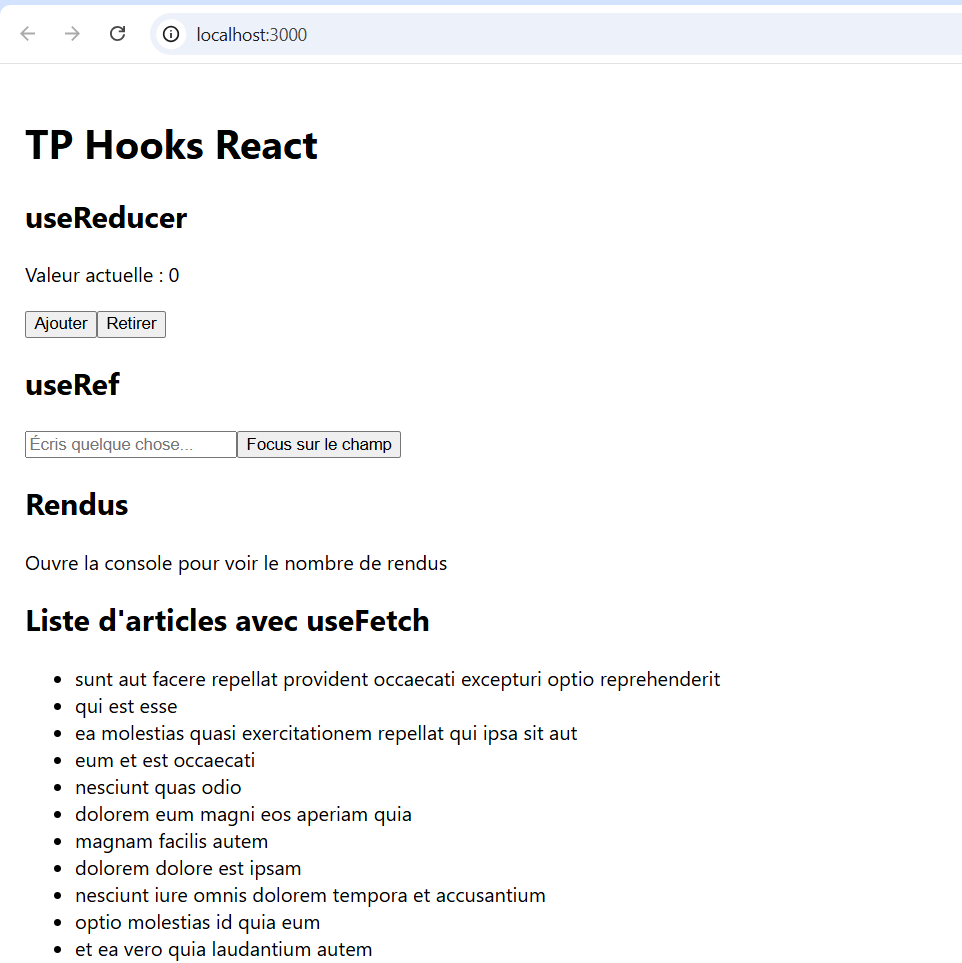
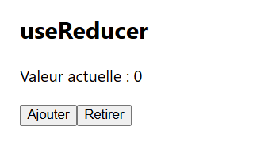
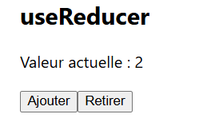
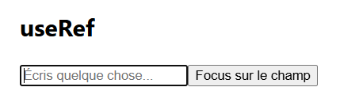
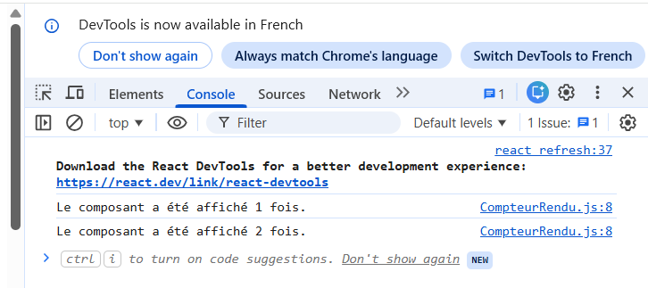
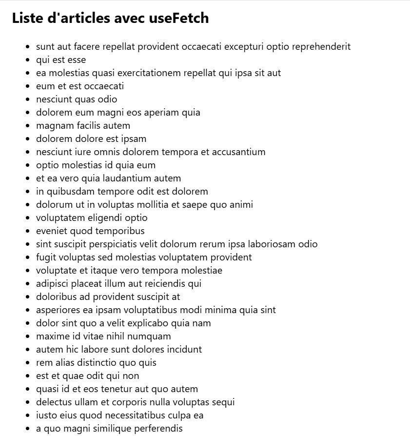
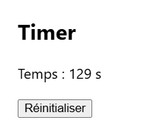

# TP React - Hooks (useReducer, useRef, useEffect)

## 📌 Description

Ce projet est une application développée avec **React.js**.

Il permet de manipuler les concepts suivants :
- useReducer pour gérer un état complexe
- useRef pour manipuler le DOM
- useEffect avec nettoyage
- Création d’un Hook personnalisé
- Appel d’une API et affichage dynamique

---

## 🛠 Technologies utilisées

- React.js
- JavaScript (ES6)
- Node.js
- npm
- API REST (JSONPlaceholder)

---

## 📂 Structure du projet

- `App.js` : Composant principal
- `Compteur.js` : Compteur avec useReducer
- `FocusInput.js` : Focus input avec useRef
- `CompteurRendu.js` : Compteur de rendus
- `useFetch.js` : Hook personnalisé
- `ListeArticles.js` : Affichage API
- `Timer.js` : Timer avec nettoyage
- `index.js` : Point d’entrée


---

## ▶️ Exécution du projet

1. Installer les dépendances :

```bash
npm install
```

2. Lancer l’application :

```bash
npm start
```

3. Ouvrir dans le navigateur :  http://localhost:3000

---

## 🧪 Fonctionnement

Au lancement de l’application :

- Le composant Compteur permet d’incrémenter et décrmenter une valeur avec useReducer

- Le composant FocusInput permet de mettre le curseur dans un champ texte

- Le composant CompteurRendu affiche dans la console le nombre de rendus

- Le composant ListeArticles récupère et affiche des données depuis une API

- Le composant Timer affiche un compteur qui augmente chaque seconde

---

## 📸 Captures d’écran

#### 📌 Interface générale



---

#### 📌 Compteur (useReducer)




---

#### 📌 Focus Input (useRef)



---

#### 📌 Compteur de rendus




---

#### 📌 Liste des articles (useFetch)



---

#### 📌 Timer (useEffect)



---

## Auteur
- Nom : Malak El Mallouky
- Filliere : SIR

